# Omok_Server (온라인 오목 게임 서버)

## 📖 프로젝트 소개

ASP.NET Core Web API와 SignalR을 사용하여 개발한 온라인 오목 게임 서버입니다. RESTful API를 통해 사용자 인증 및 데이터 관리를 처리하고, SignalR을 통해 실시간 멀티플레이어 게임 로직을 구현했습니다.

## ✨ 주요 기능

-   **사용자 시스템 (User System)**
    -   회원가입 (BCrypt를 이용한 비밀번호 해싱)
    -   로그인 (JWT 발급)

-   **인증 및 인가 (Authentication & Authorization)**
    -   JWT Bearer 토큰을 이용한 API 요청 인증
    -   `[Authorize]` 어트리뷰트 및 정책 기반 로직을 통한 엔드포인트/리소스 접근 제어

-   **실시간 매치메이킹 및 게임플레이 (Real-time Matchmaking & Gameplay)**
    -   인메모리 큐(`ConcurrentQueue`)와 `lock`을 이용한 공정하고 안전한 매치메이킹 시스템
    -   SignalR Hub를 통한 실시간 양방향 통신 중계
    -   `GameRoom` 생성, 조회, 제거 등 게임 라이프사이클 관리
    -   게임 내 핵심 로직 처리 (수 두기, 턴 전환, 승패 판정 후 결과 자동 저장)

-   **게임 데이터 관리 (Game Data Management)**
    -   경기 결과 저장 (`Matches` 테이블)
    -   사용자별 전적 조회

-   **아키텍처 (Architecture)**
    -   DTO, Repository, Service 패턴을 적용한 계층형 아키텍처
    -   DI(의존성 주입)를 통한 유연하고 테스트 용이한 코드 구조
    -   전역 예외 처리 미들웨어를 통한 안정적인 에러 핸들링

## 🛠️ 사용 기술 (Tech Stack)

-   **Backend:** ASP.NET Core 8
-   **Database:** MySQL
-   **Data Access:** SqlKata (Query Builder)
-   **Real-time Communication:** SignalR
-   **Authentication:** JWT (JSON Web Token)
-   **Security:** BCrypt.Net-Next (Password Hashing)
-   **Logging:** ZLogger

## 🔄 전체 흐름

```mermaid
graph TD
    A["시작 (Start)"] --> B["클라이언트: 로그인/회원가입 UI"];
    B --> C["클라이언트: ID/PW 입력 후 로그인 요청"];
    C -- "HTTP POST /api/users/login" --> D["서버: 사용자 인증 처리"];
    D --> E{"로그인 성공?"};
    E -- "Yes" --> F["클라이언트: 로비 진입, 토큰 저장,<br/>SignalR 연결 및 등록"];
    E -- "No" --> B;
    
    F --> G["클라이언트: '게임 찾기' 버튼 클릭"];
    G -- "HTTP POST /api/matchmaking/queue" --> H["서버: MatchmakingService 대기열에 추가"];
    H --> I["클라이언트: '매칭 대기 중...' UI 표시"];
    I -.-> J["서버: 매칭 성공 및<br/>'MatchFound' 알림 전송"];
    J -- "SignalR 수신" --> K["클라이언트: 게임 씬으로 전환"];
    
    K --> L["클라이언트: 오목돌 놓기"];
    L -- "SignalR 'PlaceStone'" --> M["서버: GameHub에서 수신 및<br/>게임 상태 업데이트"];
    M --> N["서버: 양쪽 클라이언트에<br/>'StonePlaced' 전파"];
    N -- "SignalR 수신" --> K;
    M --> O{"게임 종료?"};
    O -- "No" --> K;
    O -- "Yes" --> P["서버: DB에 결과 저장 및<br/>'GameOver' 알림 전파"];
    P -- "SignalR 수신" --> Q["클라이언트: 결과 화면 표시"];
    Q --> F;
```

## 🚀 앞으로의 계획 (TODO)

-   [ ] Refresh Token을 이용한 JWT 인증 시스템 고도화
-   [ ] Unity 클라이언트 구현 (API 및 SignalR 연동, 게임 UI/UX)