# Omok_Server (온라인 오목 게임 서버)

## 📖 프로젝트 소개

ASP.NET Core Web API와 SignalR을 사용하여 개발한 온라인 오목 게임 서버입니다. RESTful API를 통해 사용자 인증 및 데이터 관리를 처리하고, SignalR을 통해 실시간 멀티플레이어 게임 로직을 구현했습니다.

## ✨ 주요 기능

-   **사용자 시스템 (User System)**
    -   회원가입 (BCrypt를 이용한 비밀번호 해싱)
    -   로그인 (JWT 발급)

-   **인증 및 인가 (Authentication & Authorization)**
    -   JWT Bearer 토큰을 이용한 API 요청 인증
    -   `[Authorize]` 어트리뷰트 및 정책 기반 로직을 통한 엔드포인트/리소스 접근 제어

-   **실시간 매치메이킹 및 게임플레이 (Real-time Matchmaking & Gameplay)**
    -   인메모리 큐(`ConcurrentQueue`)와 `lock`을 이용한 공정하고 안전한 매치메이킹 시스템
    -   SignalR Hub를 통한 실시간 양방향 통신 중계
    -   `GameRoom` 생성, 조회, 제거 등 게임 라이프사이클 관리
    -   게임 내 핵심 로직 처리 (수 두기, 턴 전환, 승패 판정 후 결과 자동 저장)

-   **게임 데이터 관리 (Game Data Management)**
    -   경기 결과 저장 (`Matches` 테이블)
    -   사용자별 전적 조회

-   **아키텍처 (Architecture)**
    -   DTO, Repository, Service 패턴을 적용한 계층형 아키텍처
    -   DI(의존성 주입)를 통한 유연하고 테스트 용이한 코드 구조
    -   전역 예외 처리 미들웨어를 통한 안정적인 에러 핸들링

## 🛠️ 사용 기술 (Tech Stack)

-   **Backend:** ASP.NET Core 8
-   **Database:** MySQL
-   **Data Access:** SqlKata (Query Builder)
-   **Real-time Communication:** SignalR
-   **Authentication:** JWT (JSON Web Token)
-   **Security:** BCrypt.Net-Next (Password Hashing)
-   **Logging:** ZLogger

## 🔄 전체 흐름

```mermaid
graph LR
    subgraph "1. 인증 (Authentication)"
        direction LR
        A([시작]) --> B[로그인/회원가입 UI];
        B --> C[ID/PW 입력 후 로그인 요청];
        C -- "HTTP POST" --> D[서버: 사용자 인증];
        D --> E{성공?};
        E -- "Yes (JWT)" --> F[로비 진입 및 SignalR 연결];
        E -- "No (401)" --> B;
    end

    subgraph "2. 매치메이킹 (Matchmaking)"
        direction LR
        F --> G['게임 찾기' 버튼 클릭];
        G -- "HTTP POST" --> H[서버: 대기열 추가];
        H --> I['매칭 대기 중...' UI];
        I -. "SignalR 대기" .-> J{매칭 성공?};
    end
    
    subgraph "3. 인게임 (In-Game Loop)"
        direction TD
        J -- "'MatchFound' 수신" --> K[게임 씬 전환];
        K --> L[오목돌 놓기];
        L -- "SignalR 'PlaceStone'" --> M[서버: 수 검증/처리];
        M -- "'StonePlaced' 전파" --> K;
        M --> O{게임 종료?};
        O -- "No" --> K;
    end

    subgraph "4. 게임 종료 (Game End)"
        direction LR
        O -- "Yes" --> P[서버: 결과 저장/알림];
        P -- "'GameOver' 수신" --> Q[결과 화면 표시];
        Q --> F;
    end
```

## 🚀 앞으로의 계획 (TODO)

-   [ ] Refresh Token을 이용한 JWT 인증 시스템 고도화
-   [ ] Unity 클라이언트 구현 (API 및 SignalR 연동, 게임 UI/UX)